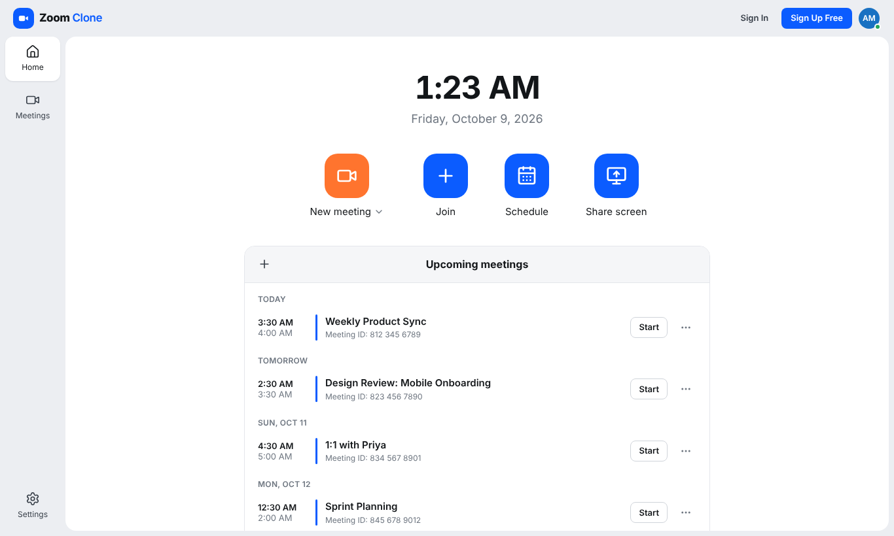
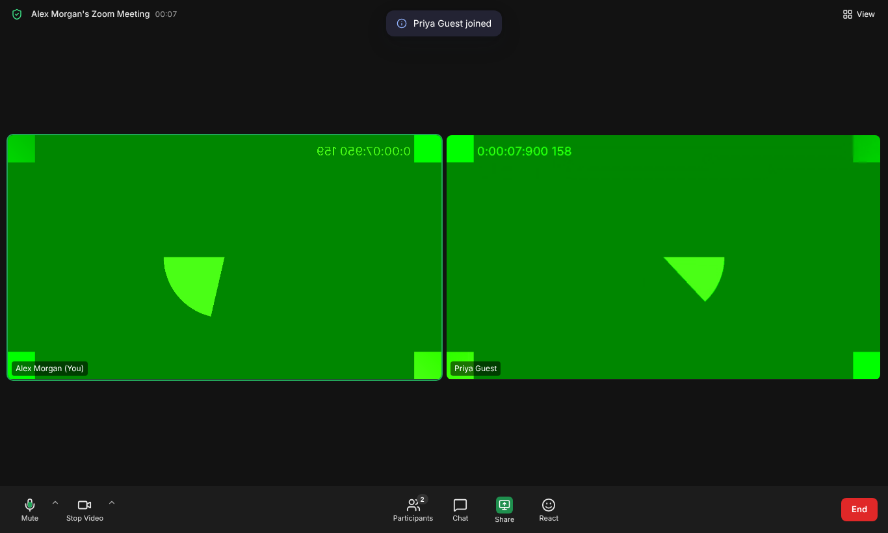
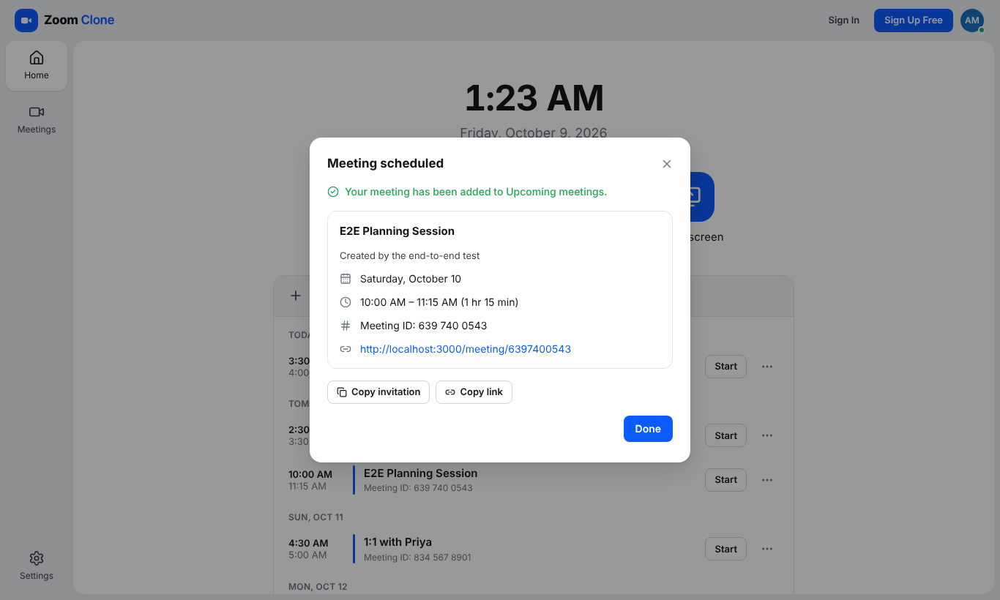
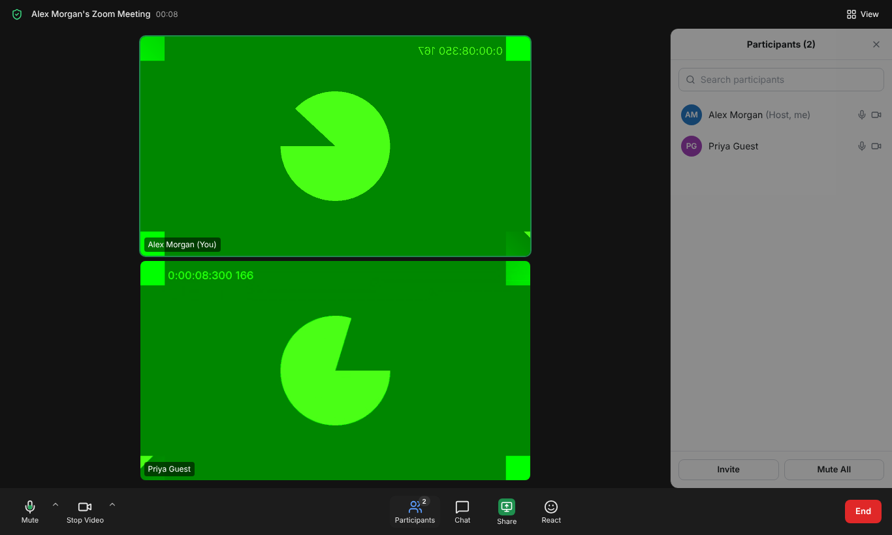
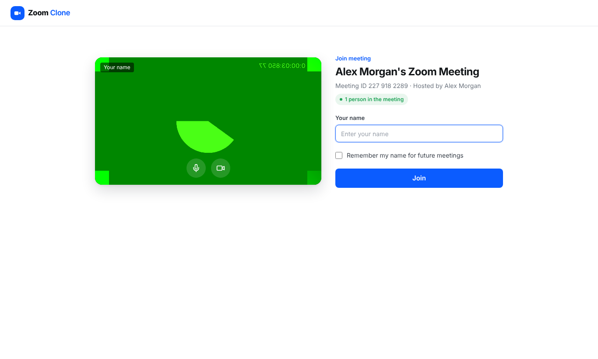
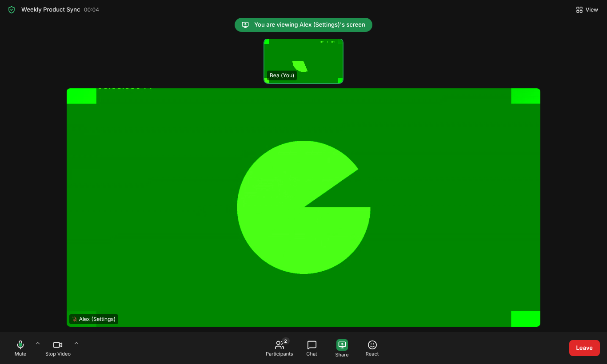
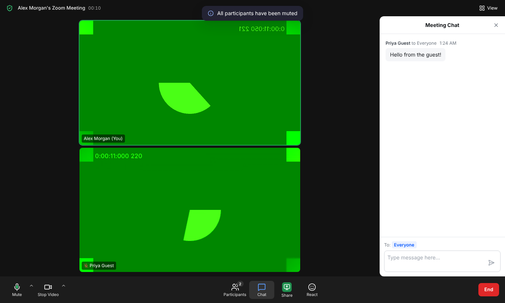
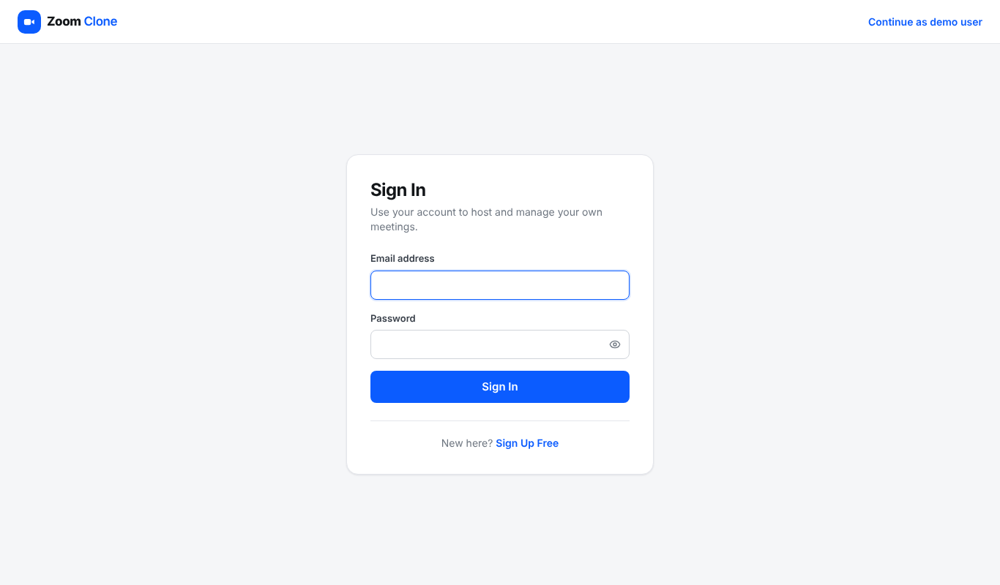

# Zoom Clone — Video Conferencing Web App

A functional clone of the Zoom web experience: create instant meetings, join by meeting ID or invite link, schedule meetings, and meet in a Zoom-style room with real peer-to-peer audio/video, a participants panel, chat, reactions, screen sharing and host controls.

- **Frontend:** Next.js 16 (App Router, client-side SPA navigation), React 19, TypeScript, Tailwind CSS 4
- **Backend:** Python 3.12, FastAPI, SQLAlchemy 2, Pydantic 2
- **Database:** SQLite (own schema, seeded with sample data)

---

## 1. Features

### Core (assignment requirements)
| Feature | What it does |
|---|---|
| **Dashboard** | Laid out like the Zoom Workplace app: left navigation rail (Home / Meetings / Settings; a bottom tab bar on phones), top bar with profile, a large live clock and date, Zoom's four big tiles — **New meeting** (with a *Start with video* dropdown), **Join**, **Schedule**, **Share screen**, then a calendar-style card with **Upcoming meetings** (grouped by day) and a **Recent meetings** list — all loaded from the database. |
| **Instant meeting** | *New meeting* → backend generates a unique 10-digit Meeting ID, stores the meeting, returns an invite link (`/meeting/<id>`) → you are taken straight into the room as host. |
| **Join meeting** | Join by Meeting ID (`8123456789`, `812 345 6789`, `812-345-6789`) **or** by pasting an invite link. A display name is required. The meeting is validated on the server; unknown IDs show *"Meeting not found. Please check the meeting ID and try again."* |
| **Invite link** | Opening `/meeting/<id>` validates the meeting, shows a camera/mic preview and asks for your name, then joins. |
| **Schedule meeting** | Topic, description, date, time (15-min steps), duration (hours + minutes, 15 min–24 h), time-zone display. Validated client- and server-side, stored with a proper UTC `DATETIME`, link generated automatically, appears in Upcoming immediately. |
| **Meeting room** | Meeting info (ID, host, invite link), gallery / speaker view, your name on every tile, mute/unmute, start/stop video, participants panel, chat, leave/end, and a "Waiting for others to join" empty state. |

### Bonus features (all three from the brief)
- **User authentication (Login/Signup):** optional *Sign Up Free* / *Sign In* pages. Signed-in users get their own dashboard, meetings and host rights; without signing in the app uses the default demo user, exactly as the brief requires ("assume a default user is logged in"). Passwords are hashed (PBKDF2-SHA256 with salt); sign-ins are random tokens stored only as SHA-256 hashes and expire after 30 days.
- **Host controls:** Mute all, mute a participant, remove a participant, end meeting for all. If the host leaves, host is handed to the next participant; the owner reclaims host on rejoin.
- **Responsive design:** phone, tablet and desktop layouts.

**Demo account:** `alex.morgan@example.com` / `zoomdemo123` (all seeded accounts use the same password).

### Beyond the minimum
- **Real audio/video** between participants (WebRTC mesh; the backend only relays signalling).
- Screen sharing, emoji reactions, raise hand, in-meeting chat, mic/camera device picker, live mic-level indicator.
- Settings dialog (default display name, join muted, join with video off) stored per browser.
- Meetings page (Zoom desktop style list + detail) with copy invitation / copy link / delete.
- Refreshing the meeting page resumes your session instead of joining twice.

### Screenshots
| Home (dashboard) | Meeting room — two browsers with real video |
|---|---|
|  |  |
| **Schedule meeting** | **Participants panel & host controls** |
|  |  |
| **Join via invite link (camera preview)** | **Screen sharing (viewer's side)** |
|  |  |
| **In-meeting chat** | **Sign in** |
|  |  |

Also in [`docs/screenshots/`](docs/screenshots): the phone layout and the "meeting not found" page. The green video in the screenshots is Chrome's built-in fake test camera, used by the automated browser tests.

---

## 2. Architecture

```
┌──────────────────────────┐   REST/JSON (fetch)    ┌───────────────────────────┐
│ Next.js (browser SPA)    │ ─────────────────────▶ │ FastAPI                    │
│  app/  routes            │                        │  api/routes   (HTTP only)  │
│  components/  UI         │ ◀───────────────────── │  services/    (business)   │
│  lib/api      API client │                        │  models/      (SQLAlchemy) │
│  lib/meeting  room hooks │                        │  schemas/     (Pydantic)   │
└────────────┬─────────────┘                        └─────────────┬─────────────┘
             │  WebRTC media (peer-to-peer)                      │ SQLAlchemy ORM
             ▼                                                   ▼
        other browsers                                     SQLite database
```

- The **frontend** is a client-rendered SPA on Next.js routes. All data comes from the API through one small client (`lib/api/client.ts`) with typed wrappers.
- The **backend** is layered: routes are thin (parse request → call service → return schema), services hold all business rules and raise domain errors (`core/errors.py`), and `main.py` maps those errors to HTTP status codes.
- **Real-time presence without WebSockets:** each browser in a meeting sends a heartbeat every 2 s, which returns the live roster and meeting status. Participants who stop sending heartbeats for 20 s are marked as timed out the next time anyone looks at the meeting ("lazy expiry", no background worker). Chat and WebRTC signalling are polled the same way.
- **Media:** cameras/mics are captured with `getUserMedia`. Browsers connect directly to each other (`RTCPeerConnection`, public STUN). The API only stores short-lived signalling messages (offer/answer/ICE). Media code is isolated in `lib/meeting/useWebRTC.ts`; if it fails, everything else still works and tiles show names.

### Project structure
```
zoom-clone/
├── backend/
│   ├── app/
│   │   ├── api/            deps.py, router.py, routes/{auth,meetings,participants,messages,signals,users,health}.py
│   │   ├── core/           config, errors, security (password hashing, tokens), time (UTC), meeting_codes, logging
│   │   ├── database/       base (declarative + timestamps), session (engine, FK pragma), init_db
│   │   ├── models/         user, auth_session, meeting, participant, chat_message, signal, enums
│   │   ├── schemas/        Pydantic request/response models + validation
│   │   ├── services/       auth, meeting, participant, presence, chat, signal, user services
│   │   ├── seed/seed.py    sample data
│   │   └── main.py         app factory, CORS, exception handlers
│   ├── tests/              pytest suite (44 tests)
│   ├── requirements.txt / requirements-dev.txt / .env.example
├── frontend/
│   ├── app/                routes: / , /meetings , /join , /meeting/[meetingId] , /signin , /signup
│   ├── components/         ui/ layout/ auth/ dashboard/ meetings/ meeting-room/ providers/
│   ├── lib/                api/ (client + endpoints), auth/ (token storage), meeting/ (room hooks), hooks/, format, preferences
│   └── types/api.ts        TypeScript mirrors of API schemas
├── e2e/                    Playwright scripts that drive the real app in Chromium
├── docs/screenshots/       screenshots used in this README
├── .github/workflows/ci.yml  lint + tests + production build on every push
├── render.yaml             Render blueprint for the API
└── README.md
```

---

## 3. Database schema

```
auth_sessions *───1── users ──1───*── meetings ──1───*── participants ──1───*── chat_messages
  │   (host_id)     │                    │
  └──0..1────*──────┘ (participants.user_id, NULL for guests)
                    └──1───*── signals (sender_id / recipient_id → participants)
```

| Table | Key columns | Notes |
|---|---|---|
| `users` | `id` PK, `name`, `email` **UNIQUE**, `password_hash` (nullable), timestamps | The default demo user, seeded colleagues and people who sign up. Passwords stored only as salted PBKDF2 hashes. |
| `auth_sessions` | `id` PK, `user_id` FK (cascade), `token_hash` **UNIQUE**, `expires_at`, timestamps | One row per signed-in browser; the raw token is never stored. Sign out deletes the row. |
| `meetings` | `id` PK (internal), `meeting_code` **UNIQUE + indexed** (public 10-digit ID), `title`, `description`, `host_id` FK→users, `meeting_type` (`instant`/`scheduled`), `status` (`scheduled`/`live`/`ended`/`cancelled`), `scheduled_start` DATETIME, `duration_minutes`, `started_at`, `ended_at`, timestamps | CHECK: duration > 0; CHECK: scheduled meetings must have a start time; composite index `(host_id, status, scheduled_start)` for the Upcoming query. |
| `participants` | `id` PK, `meeting_id` FK (cascade), `user_id` FK nullable, `display_name`, `role` (`host`/`attendee`), `session_token` **UNIQUE**, `is_muted`, `is_video_on`, `hand_raised`, `is_screen_sharing`, `reaction`, `reaction_at`, `joined_at`, `last_seen_at`, `left_at`, `left_reason` (`left`/`removed`/`timed_out`/`meeting_ended`), timestamps | One row per attendance. "Active" = `left_at IS NULL`; index `(meeting_id, left_at)`. Keeping rows after leaving gives meeting history. |
| `chat_messages` | `id` PK, `meeting_id` FK, `participant_id` FK (SET NULL), `sender_name` (snapshot), `body`, timestamps | Index `(meeting_id, id)` for "messages after id X" polling. |
| `signals` | `id` PK, `meeting_id`, `sender_id`, `recipient_id`, `kind` (`offer`/`answer`/`candidate`), `payload` JSON text | Transient WebRTC signalling mailbox; rows are deleted once the recipient acknowledges them. |

Enums are stored as `VARCHAR` with `CHECK` constraints (SQLite has no enum type). All datetimes are stored as UTC and returned as ISO-8601 with `Z`. Foreign keys are enforced (`PRAGMA foreign_keys=ON`).

---

## 4. API overview

Base path: `/api`. Interactive docs at **`http://localhost:8000/docs`**. Errors always look like `{"detail": "<human readable>", "code": "<machine code>"}`.

| Method | Path | Purpose | Success |
|---|---|---|---|
| GET | `/health` | Liveness + DB check | 200 |
| POST | `/auth/signup` | Create an account `{name, email, password}` → `{user, token, expires_at}` | 201 · 409 · 422 |
| POST | `/auth/login` | Sign in `{email, password}` → `{user, token, expires_at}` | 200 · 401 |
| POST | `/auth/logout` | End the current sign-in | 204 |
| GET | `/users/me` | Current user (signed-in account, or the default demo user) + `is_authenticated` | 200 · 401 |
| POST | `/meetings/instant` | Create an instant meeting (live immediately) | 201 |
| POST | `/meetings` | Schedule a meeting `{title, description?, start_time, duration_minutes}` | 201 |
| GET | `/meetings/upcoming` | My scheduled meetings that haven't finished | 200 |
| GET | `/meetings/recent` | Meetings I hosted or attended that have taken place | 200 |
| GET | `/meetings/{meeting_id}` | Validate / fetch a meeting (accepts formatted IDs) | 200 · 404 · 422 |
| DELETE | `/meetings/{meeting_id}` | Cancel a scheduled meeting (soft delete) | 204 |
| POST | `/meetings/{meeting_id}/end` | Host: end for everyone | 204 |
| POST | `/meetings/{meeting_id}/participants` | Join `{display_name, as_host?, is_muted?, is_video_on?}` → participant + `session_token` | 201 · 404 · 410 · 422 |
| GET | `/meetings/{meeting_id}/participants` | Active participants | 200 |
| POST | `/meetings/{meeting_id}/participants/me/heartbeat` | Keep-alive; returns me, roster, meeting status | 200 |
| PATCH | `/meetings/{meeting_id}/participants/me` | Update my mic/video/hand/screen-share/reaction | 200 |
| POST | `/meetings/{meeting_id}/participants/me/leave` | Leave | 204 |
| POST | `/meetings/{meeting_id}/participants/mute-all` | Host: mute everyone else | 200 |
| POST | `/meetings/{meeting_id}/participants/{id}/mute` | Host: mute one participant | 200 |
| DELETE | `/meetings/{meeting_id}/participants/{id}` | Host: remove participant | 204 |
| GET/POST | `/meetings/{meeting_id}/messages` | Chat (poll with `?after_id=`) | 200 / 201 |
| GET/POST | `/meetings/{meeting_id}/signals` | WebRTC signalling relay | 200 / 201 |

Signed-in requests send **`Authorization: Bearer <token>`**; without it the API acts as the default demo user. An invalid/expired token returns 401 `invalid_auth_token` (the frontend then forgets it and continues as the demo user). Participant actions are authorised with the **`X-Participant-Token`** header (a random secret returned when joining, scoped to one meeting).

---

## 5. Local setup

### Prerequisites
- Python **3.11+** (3.12 recommended)
- Node.js **20.9+** (22 recommended) and npm

Run the backend and the frontend in two separate terminals.

### Backend
```bash
cd backend
python -m venv .venv
source .venv/bin/activate            # Windows: .venv\Scripts\activate
pip install -r requirements-dev.txt  # or requirements.txt for runtime only
cp .env.example .env                 # optional – defaults work for local dev
python -m app.seed.seed --reset      # create tables + load sample data
uvicorn app.main:app --reload --port 8000
```
The API runs at http://localhost:8000 (docs at `/docs`).

### Frontend
```bash
cd frontend
npm install
cp .env.example .env.local           # NEXT_PUBLIC_API_URL=http://localhost:8000
npm run dev                          # http://localhost:3000
```
Production build: `npm run build && npm start`.

### Environment variables

**Backend** (`backend/.env`)
| Variable | Default | Description |
|---|---|---|
| `DATABASE_URL` | `sqlite:///./zoom_clone.db` | SQLAlchemy URL of the SQLite file |
| `FRONTEND_URL` | `http://localhost:3000` | Used to build invite links |
| `CORS_ORIGINS` | `http://localhost:3000,http://127.0.0.1:3000` | Comma-separated allowed browser origins |
| `SEED_ON_STARTUP` | `false` | Seed sample data on startup if the DB has no meetings |
| `DEFAULT_USER_NAME` / `DEFAULT_USER_EMAIL` | `Alex Morgan` / `alex.morgan@example.com` | The always-logged-in user |
| `PARTICIPANT_TIMEOUT_SECONDS` | `20` | Heartbeat timeout before a participant is considered gone |
| `DEMO_PASSWORD` | `zoomdemo123` | Password for the default and seeded demo accounts |
| `AUTH_SESSION_DAYS` | `30` | How long a sign-in lasts |

**Frontend** (`frontend/.env.local`)
| Variable | Description |
|---|---|
| `NEXT_PUBLIC_API_URL` | Base URL of the backend, no trailing slash (inlined at build time) |

### Database initialisation & seed data
- Tables are created automatically when the API starts (`create_all`), and the default user is ensured.
- **After pulling a version that changes the schema, run `python -m app.seed.seed --reset`** (`create_all` creates missing tables but doesn't add columns to existing ones).
- `python -m app.seed.seed` seeds only if there are no meetings; `--reset` drops and recreates everything first.
- Seed contents: the default user **Alex Morgan** plus 3 colleagues (all can sign in with password `zoomdemo123`); **5 upcoming** meetings (times relative to now) with fixed IDs `8123456789`, `8234567890`, `8345678901`, `8456789012`, `8567890123`; **5 past** meetings with participants and chat (`7123456780` … `7567801234`), one hosted by Priya Sharma that Alex attended; and one cancelled meeting (`7999999999`) that is correctly hidden.

### Tests
```bash
cd backend && pytest -q                 # 44 API/service tests
cd frontend && npm run lint && npm run build
# Browser end-to-end checks (backend + frontend running, freshly seeded DB):
cd e2e && npm install && npm run all   # core + extra + auth (54 checks)
```
GitHub Actions (`.github/workflows/ci.yml`) runs the backend lint + tests and the frontend lint + production build on every push.

The e2e scripts launch Chromium with a fake camera/microphone and drive two or three browser contexts through every main workflow (create, join by ID and link, schedule, chat, mute all, remove, leave/end, screen share, reactions, refresh-resume, sign up / sign in / sign out, Share screen tile).

---

## 6. How to use

1. **Start a meeting:** Home → **New meeting**. You're in the room as host; copy the link from the "Waiting for others" card or the green shield (meeting info).
2. **Invite someone:** open the link in another browser/profile/device (or private window), enter a name, click **Join**.
3. **Join by ID:** Home → **Join** → enter `812 345 6789` (seeded) or any meeting ID / link, plus your name.
4. **Schedule:** Home → **Schedule** (or the Meetings tab +) → fill in the form → **Save**. The confirmation shows the link; the meeting appears in Upcoming. Use **Start** to begin it as host.
5. **Share screen:** Home → **Share screen** → enter a meeting ID → you join and are asked to pick a screen to share.
6. **In the meeting:** Mute/Stop Video (chevrons pick devices), Participants (host: Mute All / Mute / Remove), Chat, Share, React (emoji / Raise Hand), **View** (Speaker / Gallery), **End** (host: End for all / Leave) or **Leave**.
7. **Your own account (optional):** **Sign Up Free** (top right) → you get your own empty dashboard; meetings you create are yours. **Sign Out** from the profile menu returns to the demo user.

### Testing with two people on one laptop
Open the invite link in an **Incognito window** (or a second browser) and join with another name. Notes:
- On Windows, a camera can often be used by only **one window at a time**. The second window joins without video, and **Start Video** shows "Your camera is being used by another app…". Stop video in the first window, then click Start Video again in the second.
- Each remote tile shows **"Connecting audio/video…"** until the two browsers have connected peer-to-peer, and **"Can't connect audio/video"** if they can't. That usually means a VPN, firewall or browser privacy extension is blocking WebRTC. Chat, participants and host controls still work in that case.
- Other devices (phones, friends) need the deployed **HTTPS** version: browsers only allow camera/microphone on `localhost` or HTTPS.

---

## 7. Deployment

The frontend and backend deploy separately.

### Backend → Render (blueprint included)
1. Push this repo to GitHub (public).
2. In Render: **New → Blueprint**, select the repo; it reads `render.yaml` (root dir `backend`, start `uvicorn app.main:app --host 0.0.0.0 --port $PORT`, health check `/api/health`).
3. After the frontend is deployed, set `FRONTEND_URL=https://<your-app>.vercel.app` and `CORS_ORIGINS=https://<your-app>.vercel.app` and redeploy.
4. SQLite on the free plan lives on an ephemeral disk, so `SEED_ON_STARTUP=true` re-seeds after each restart. For persistence attach a Render Disk at `/var/data` and set `DATABASE_URL=sqlite:////var/data/zoom_clone.db` (Railway volumes or a small VM work the same way).

### Frontend → Vercel
1. **Import Project** → select the repo → **Root Directory: `frontend`** (framework auto-detected).
2. Environment variable: `NEXT_PUBLIC_API_URL=https://<your-api>.onrender.com`.
3. Deploy, then update the backend's `FRONTEND_URL` / `CORS_ORIGINS` as above.

Camera/microphone access requires HTTPS in production (both Vercel and Render provide it).

---

## 8. Assumptions & design decisions
- **Default user + optional sign-in** (per the brief "assume a default user is logged in"): without signing in, everything belongs to the default demo user. Signing up/in is the bonus feature and switches the dashboard to your own account. People who join via an invite link without signing in are **guests** (name only, `user_id = NULL`); signed-in attendees are linked to their account so the meeting shows in their Recent list.
- **Host role:** the meeting owner becomes host when they start the meeting from *New meeting* / *Start*. Opening a plain invite link joins as an attendee (for the shared demo user every browser is the same account, so the explicit "Start" action is what distinguishes the host).
- **Meeting IDs** are 10-digit numbers from a CSPRNG (`secrets`), never generated on the client; uniqueness is enforced by a UNIQUE index with retry on collision.
- **Lifecycle:** instant meetings are `live` on creation; scheduled meetings become `live` when someone joins; a meeting becomes `ended` when the last person leaves or the host ends it. Joining an ended meeting re-opens it (like a reusable Zoom meeting ID); cancelled meetings cannot be joined. A scheduled meeting that has already been held moves from Upcoming to Recent.
- **Recent meetings** = meetings the user hosted or attended (as the logged-in account) that have started.
- **Chat** history is visible from the moment you join (like Zoom).
- Brand: the logo is an original mark — Zoom's trademarked logo is intentionally not reused.

## 9. Known limitations
- **WebRTC mesh + public STUN only:** fine for small meetings (each browser connects to every other). Strict corporate networks/symmetric NATs need a TURN server, and large meetings would need an SFU (e.g. LiveKit, mediasoup). If media can't connect, presence/chat/controls still work and tiles show the participant's name.
- **Polling instead of WebSockets:** ~2 requests/second per participant — simple and reliable for a demo, but WebSockets/SSE would be used at scale.
- **SQLite:** single-writer and file-based; good for this scope, but production would use PostgreSQL + Alembic migrations (tables are currently created with `create_all`).
- **Auth scope:** sign-up/sign-in only — no email verification, password reset or login rate limiting. Anyone with a meeting ID can join (no passcode / waiting room); host-only actions are protected by the per-participant token.
- Screen sharing needs a desktop browser (`getDisplayMedia` isn't available on most mobile browsers, so the button is hidden there).
